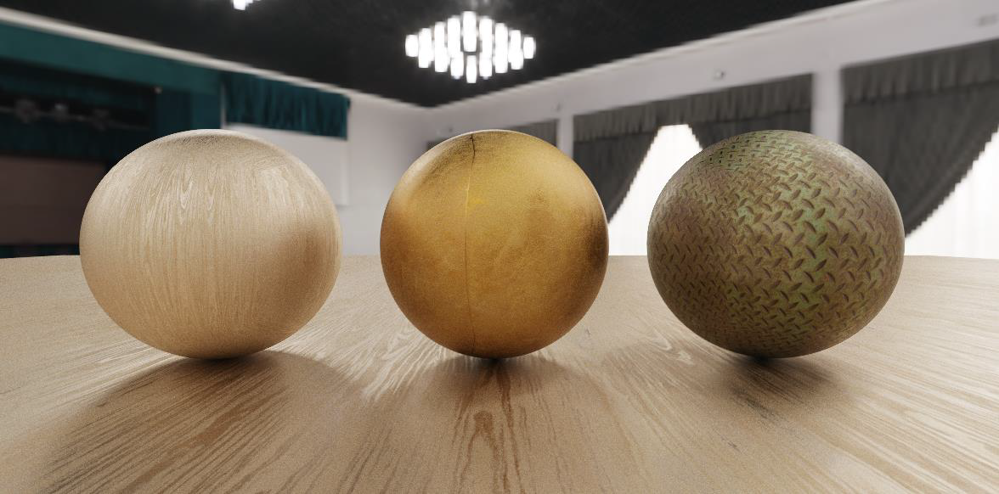
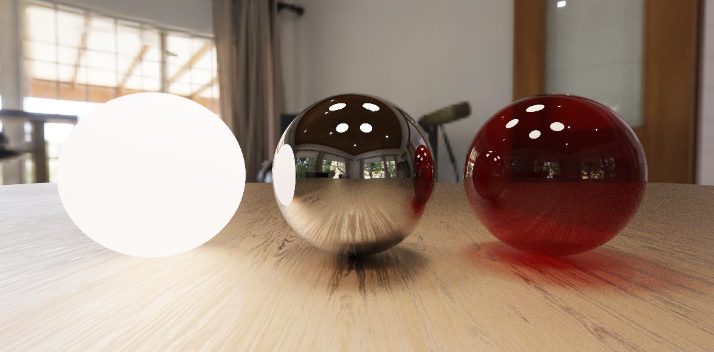
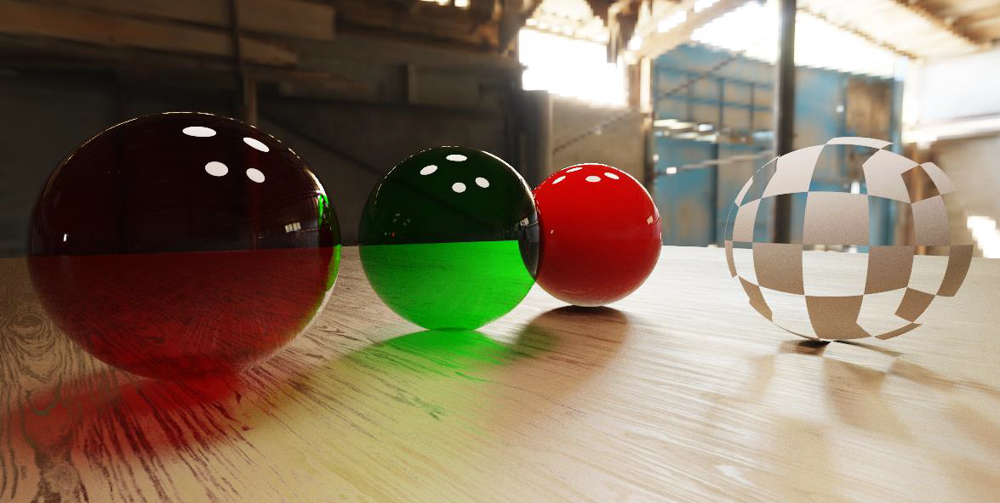
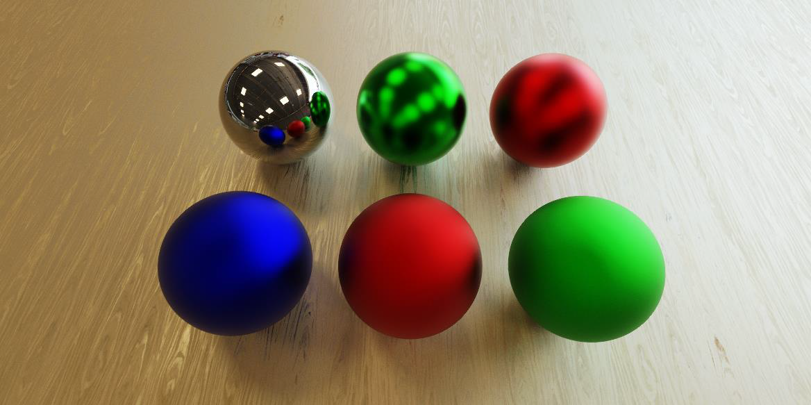
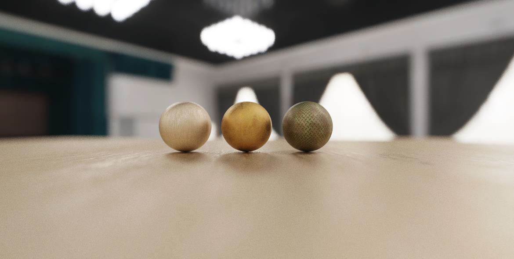
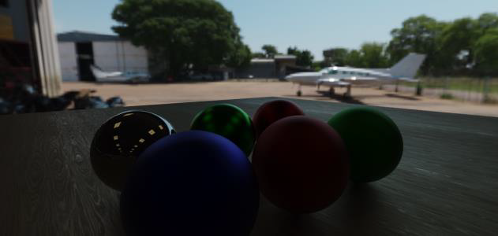
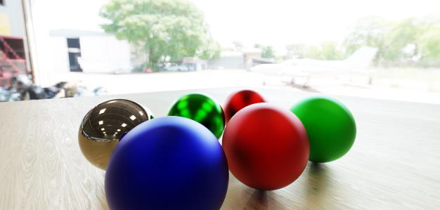

# Simple Raytracer

This is a very simple raytracer which was made for my Computer Graphics course in Computer Science university.
It uses OpenGL to offload the pathtracing to the GPU. The entire program runs in a GLSL fragment shader.
It supports the following features:
* Materials: Matte, reflective, transparent, and glossy;
* Textures, environment maps, including alpha coverage and emission;
* Antialiasing, depth of field;
* Post-process effects: filmic tonemapping and exposure adjustment to convert to LDR;

Its major limitation is the fact that it only accepts sphere and quad primitives as input.
Scenes are entirely hard-coded within the GLSL shader.

## Renders
Here are some renders which show the renderer's capabilities.









## Build and Run

Clone the repository:
```bat 
git clone https://github.com/LeonardoTemperanza/SimpleRaytracer
```

### Windows
In a Visual Studio Command Prompt, run the build_win.bat script to build and run.

### Mac
With clang installed, run the build_mac.sh script to build and run.

### Linux
Run the following command:
```sh 
sudo apt-get install libglfw3 libglfw3-dev
```
Or, on Red Hat-based systems:
```sh 
sudo dnf install glfw glfw-devel
```

With gcc installed, run the build_linux.sh script to build and run.
